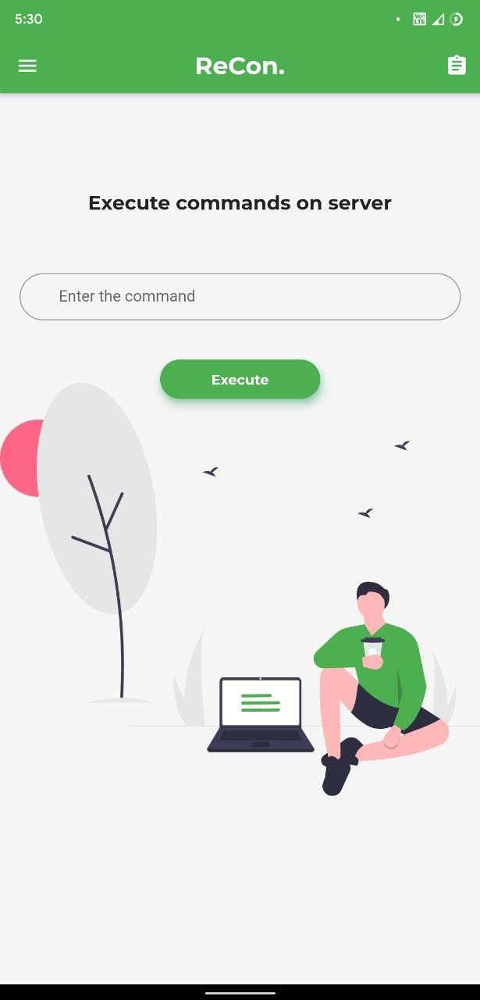
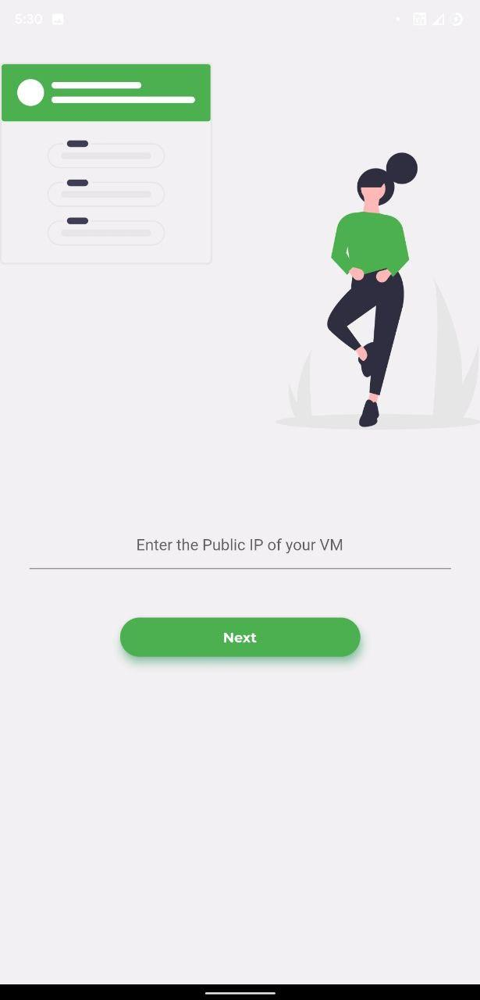

  

  As the coronavirus (aka Covid-19) continues to spread around the world, many companies have now introduced policies to accommodate remote working while also helping to limit the impact on productivity.

 

       

  

 

  

 

